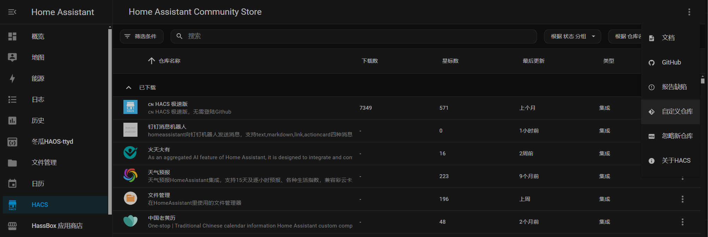
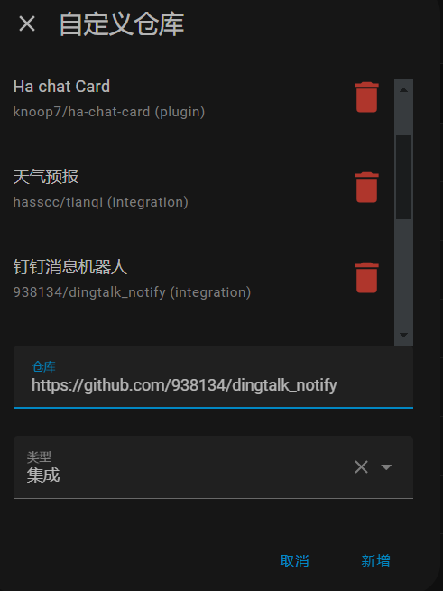
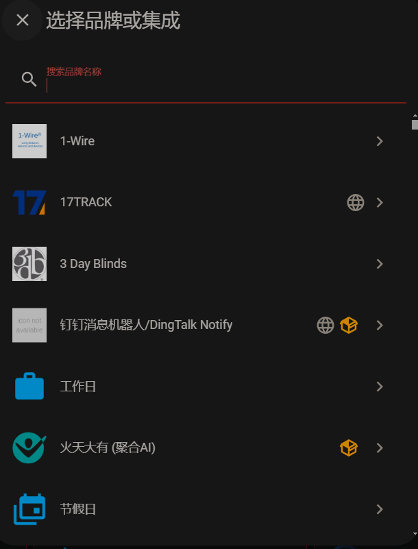
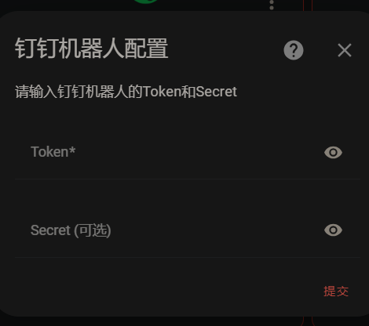
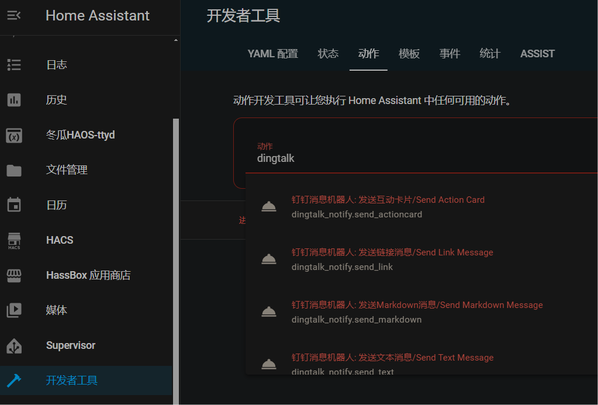
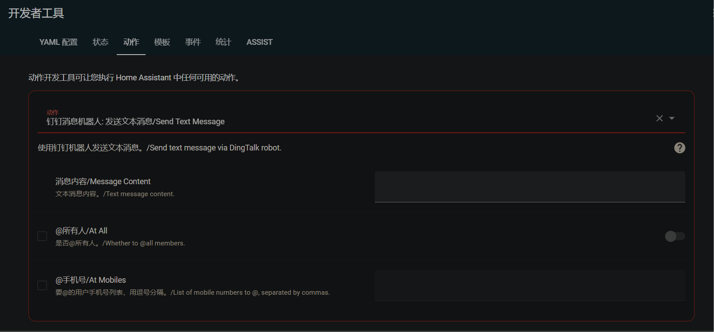
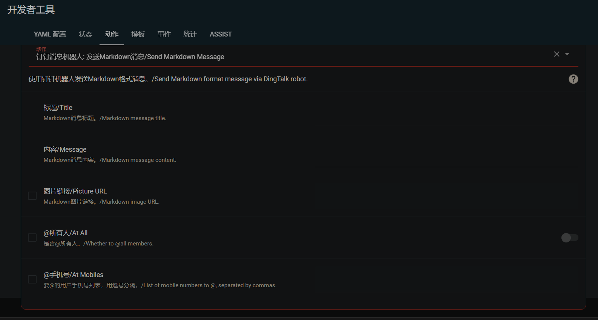
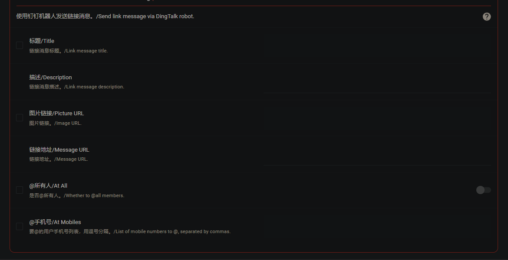
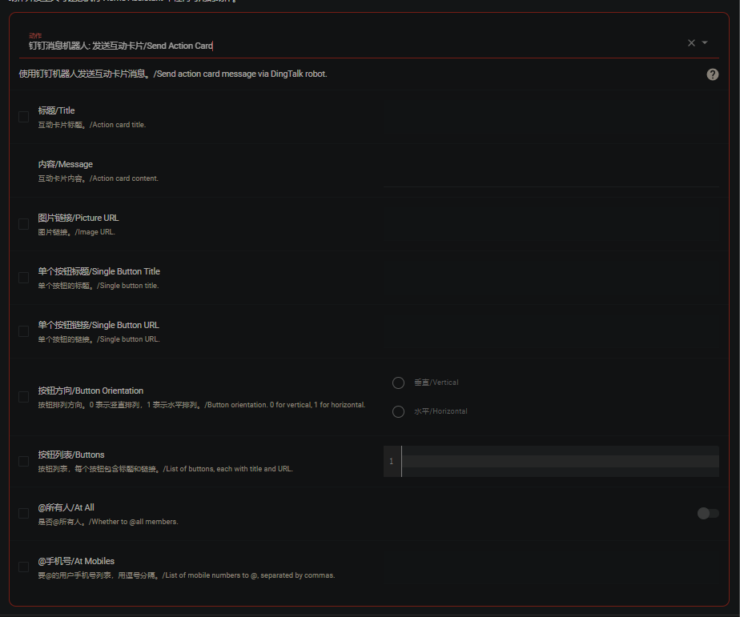

# dingtalk_notify

1、【简介】
homeassistant向钉钉机器人发送消息，支持text,markdown,link,actioncard四种消息类型

2、【安装方法】
HACS-右上角三点-自定义存储库-

在弹出的窗口中输入仓库地址和类型；

仓库——https://github.com/938134/dingtalk_notify
类型——集成

3、【集成配置】
设置-设备与服务-添加集成（右下角），在弹出的窗口中找到钉钉消息机器人

在接下来弹出的窗口中输入token和secret（可为空）

4、【消息配置】
进入开发者工具-动作-输入dingtalk，出现下图所示的四个服务就说明安装成功了

4.1 文本卡片

4.2 markdown卡片
当pivurl不为空，发送时会将嵌入到消息中，在收到的卡片中能显示图片；

4.3 链接卡片

4.4 互动卡片

